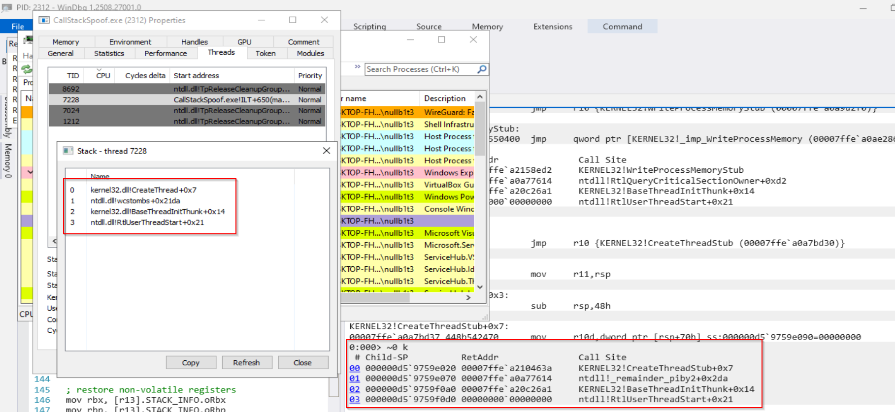

# Windows x64 Call Stack Spoofing

### Overview

This project is a Windows x64 call stack spoofing implementation built using C++ and x64 assembly, with full awareness of PE exception metadata and unwind information.

The goal of the project is educational: to deeply understand how Windows constructs, unwinds, and validates call stacks at runtime, and to prepare for advanced Windows internals and exploit development topics.

Rather than relying on hardcoded stack layouts or fragile heuristics, this implementation parses real unwind metadata from target modules and constructs synthetic call stacks that are consistent with Windows x64 unwinding rules.

### Key Features

- Unwind-aware fake stack construction

- Parses the Exception Directory (IMAGE_DIRECTORY_ENTRY_EXCEPTION)

- Handles chained unwind info

- Computes accurate stack frame sizes

- Dynamic spoof frame generation

- Builds synthetic frames from real exported functions

- Supports offsets into functions (post-prolog spoofing)

- Runtime gadget discovery

- Filters gadgets using unwind metadata safety checks

- Assembly-level stack pivot & restore

- Restores original execution flow without crashing

- Multi-argument API invocation


### High-Level Architecture

```
CallStackSpoof()
 ├─ Parsing system DLL to extract all potential jump gadgets
 ├─ Parse spoof targets function unwind information
 ├─ Build synthetic frames info array
 ├─ Select safe jump gadget
 ├─ Prepare a structure that holds all info about spoof targets and api to be called
 ├─ Invoke Spoof() (assembly)
 │    ├─ Save non-volatile registers
 │    ├─ Construct fake frames on stack
 │    ├─ Jump to target API
 │    └─ Restore stack & registers
 └─ Return to original caller
```

### Technical Details
Windows x64 Unwind Parsing

The project manually parses:

- RUNTIME_FUNCTION

- UNWIND_INFO

- UNWIND_CODE

Handled unwind operations include:

- UWOP_PUSH_NONVOL

- UWOP_ALLOC_SMALL

- UWOP_ALLOC_LARGE

- UWOP_SAVE_NONVOL

- UWOP_SAVE_NONVOL_FAR

- UWOP_PUSH_MACHFRAME

- UWOP_SAVE_XMM128

- UWOP_SAVE_XMM128_far

Each unwind sequence is translated into:

- Stack frame size

- Saved non-volatile register offsets

- Frame pointer usage detection

At the moment functions using UWOP_SET_FPREG are explicitly detected and excluded to avoid incorrect frame reconstruction.

---

Synthetic Frame Construction

Each spoofed frame includes:

- Correct return RIP (post-prolog or custom offset)

- Accurate stack reservation size

A termination frame for safe unwinding

Frames are stacked exactly as Windows expects, allowing tools such as stack walkers or debuggers to observe a plausible call stack.

---

Jump Gadget Selection

The project dynamically scans executable sections for (with a small change any other non-volatile register can be used):

```
jmp qword ptr [rbx]
```

Each candidate gadget is validated by:

- Locating its enclosing function

- Parsing its unwind info

- Rejecting gadgets with unsafe save-nonvolatile offsets

- Rejecting frame-pointer-based functions

Only unwind-safe gadgets are used.

---

Assembly Trampoline (Spoof)

The assembly routine performs:

- Saving all non-volatile registers

- Extracting the original return address

- Building synthetic frames directly on the stack

- Jumping to the target API

- Restoring the original stack and registers

- Returning execution safely to the original caller

This avoids call instructions and preserves full control over stack layout.

---

### Example Usage

A simple proof-of-concept is included to demonstrate how the call stack spoofing mechanism can be used in practice.

The PoC performs a standard sequence of actions:

1. Allocate executable memory using `NtAllocateVirtualMemory`

2. Write a payload using `WriteProcessMemory`

3. Execute the payload using `CreateThread`

All API calls are executed through the spoofing mechanism, such that the observed call stack appears to originate from legitimate Windows thread initialization routines.

For this example, two spoofed frames are used:

- `RtlUserThreadStart`

- `BaseThreadInitThunk`

Additional frames can be added if desired.

---

#### Preparing Spoof Targets

Each spoofed frame is described using a `SPOOF_TARGET` structure.
This structure defines:

- The address of the function to spoof

- The module in which the function resides

An optional offset from the function start (used to land after the prolog)

```C++
    LPCSTR SpoofName1 = "RtlUserThreadStart";
    LPCSTR SpoofName2 = "BaseThreadInitThunk";

    SPOOF_TARGET SpoofApi1 = { 0 };
    SPOOF_TARGET SpoofApi2 = { 0 };
```

First, obtain handles to the required modules and resolve the function addresses:

```C++
    // Handles to the modules that are required
    HMODULE hMod = GetModuleHandleA("ntdll.dll");
    HMODULE hMod2 = GetModuleHandleA("kernel32.dll");

    // Prepare information about the spoof targets
    SpoofApi1.funcAddress = (ULONG_PTR)GetProcAddress(hMod, SpoofName1);
    SpoofApi1.hModule = hMod;
    SpoofApi1.offsetFromStart = 0x21;

    SpoofApi2.funcAddress = (ULONG_PTR)GetProcAddress(hMod2, SpoofName2);
    SpoofApi2.hModule = hMod2;
    SpoofApi2.offsetFromStart = 0x14;
```
The offsets are chosen to ensure that execution resumes after the function prolog, matching realistic return addresses observed in legitimate call stacks.

---

#### Configuring the Spoofed Call Chain

Once the spoof targets are prepared, pointers to them are stored in an array.
This array defines the synthetic call stack that will be constructed at runtime.

```C++
    // Store them in an array for syntetic frame preparations
    spoofArray[0] = &SpoofApi1;
    spoofArray[1] = &SpoofApi2;

    apiCallInfo.spoofFramesCount = 2;
    apiCallInfo.spoofFramesTargetsArray = spoofArray;
```

The order of the array corresponds to the order of frames as they will appear on the stack.

---

#### Specifying the Target API

Before invoking the spoofed call, the target API information must be populated in the `API_CALL_INFO` structure.

This includes:

- The address of the function to be executed

- The number of arguments it expects


```C++
    apiCallInfo.pFuncAddr = pNtAllocateVirtualMemory;
    apiCallInfo.apiFuncArgsCount = 6;
```

The `retVal` member of the structure is intentionally left uninitialized, as it is populated internally with the return value of the spoofed call.

---

#### Executing the Spoofed Call

With all required information prepared, the spoofed API call can be executed using `CallStackSpoof`.

Arguments are passed as variadic parameters and are automatically placed into the correct registers and stack locations.

```C++
    PVOID addr = NULL;
    SIZE_T size = sizeof(shellcode);

    CallStackSpoof(
        &apiCallInfo,                           // NtAllocateVirtualMemory
        (uint64_t)(HANDLE)-1,                   // ProcessHandle
        (uint64_t)&addr,                        // *BaseAddress
        (uint64_t)0,                            // ZeroBits
        (uint64_t)&size,                        // RegionSize
        (uint64_t)(MEM_COMMIT | MEM_RESERVE),   // AllocationType
        (uint64_t)PAGE_EXECUTE_READWRITE        // Protect
    );
```

After the call completes, the return value can be accessed via the `retVal` field:

```C++
    status = (NTSTATUS)(ULONG_PTR)apiCallInfo.retVal;
    printf("[+] Allocation: %p, status: 0x%08X\n", addr, status);
```

Subsequent API calls (such as `WriteProcessMemory` and `CreateThread`) reuse the same spoofed call chain by updating only the target function address and argument count.

---

#### Resulting Call Stack (Simplified)

When observed under a debugger or stack-walking tool, the resulting call stack resembles the following:

```bash
0:000> ~0 k
Call Site
ntdll!NtAllocateVirtualMemory+0x3
ntdll!RtlQueryCriticalSectionOwner+0xd2  <-- jump gadget
KERNEL32!BaseThreadInitThunk+0x14
ntdll!RtlUserThreadStart+0x21
```

This demonstrates how the project constructs a plausible and unwind-consistent call stack while executing arbitrary APIs.

Allocating memory


Writing the shellcode


Creating an execution thread



---

### Limitations & Known Constraints

This project was mainly done for learning, so i guess that most likely some things can be done better :)

- No support for UWOP_SET_FPREG frames

- No exception-safe unwinding through synthetic frames

- No CFG or CET compatibility

- Gadget-based pivoting only (no epilog spoofing yet)


### TODO / Future Work

 - Full support for UWOP_SET_FPREG

 - Support for UWOP_SAVE_NONVOL with FrameOffset bigger than the stack frame size

 - Exception-safe spoofed frames

 - CFG-aware return targets

 - Extensive testing with many other APIs

---

#### Security & Ethics Notice

This project is provided for educational and research purposes only.

It is intended to:

- Understand Windows x64 internals

- Learn unwind metadata and call stack mechanics

- Prepare for advanced defensive and offensive security research

Do not use this code in unauthorized environments.

---

### Credits & References

- As always [MalDev Academy](https://maldevacademy.com/) for their incredible content that served as general inspiration for the project

- The excellent [blog post](https://dtsec.us/2023-09-15-StackSpoofin/) (and repository) from [susMdT](https://github.com/susMdT) exploring x64 call stack spoofing concepts and implementation details.

- [HulkOps — x64 Call Stack Spoofing](https://hulkops.gitbook.io/blog/red-team/x64-call-stack-spoofing) A clear and well-structured explanation of the core ideas behind call stack spoofing on Windows x64, which helped establish an initial conceptual understanding of the technique.

- The original [klezVirus — SilentMoonwalk](https://github.com/klezVirus/SilentMoonwalk) project referenced for comparative study and broader context.