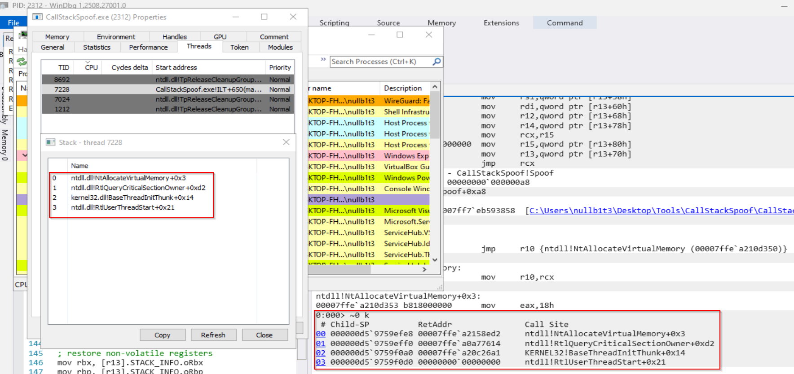
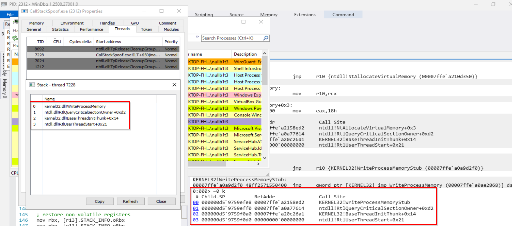

# Windows x64 Call Stack Spoofing (Unwind-Aware)

### Overview

This project is a Windows x64 call stack spoofing implementation built from first principles using C++ and x64 assembly, with full awareness of PE exception metadata and unwind information.

The goal of the project is educational: to deeply understand how Windows constructs, unwinds, and validates call stacks at runtime, and to prepare for advanced Windows internals and exploit development topics.

Rather than relying on hardcoded stack layouts or fragile heuristics, this implementation parses real unwind metadata from target modules and constructs synthetic call stacks that are consistent with Windows x64 unwinding rules.

### Key Features

- Unwind-aware fake stack construction

- Parses the Exception Directory (IMAGE_DIRECTORY_ENTRY_EXCEPTION)

- Handles chained unwind info

- Computes accurate stack frame sizes

- Dynamic spoof frame generation

- Builds synthetic frames from real exported functions

- Supports offsets into functions (post-prolog spoofing)

- Runtime gadget discovery

- Filters gadgets using unwind metadata safety checks

- Assembly-level stack pivot & restore

- Restores original execution flow without crashing

- Multi-argument API invocation


### High-Level Architecture

```
CallStackSpoof()
 ├─ Parsing system DLL to extract all potential jump gadgets
 ├─ Parse spoof targets function unwind information
 ├─ Build synthetic frames info array
 ├─ Select safe jump gadget
 ├─ Prepare a structure that holds all info about spoof targets and api to be called
 ├─ Invoke Spoof() (assembly)
 │    ├─ Save non-volatile registers
 │    ├─ Construct fake frames on stack
 │    ├─ Jump to target API
 │    └─ Restore stack & registers
 └─ Return to original caller
```

### Technical Details
Windows x64 Unwind Parsing

The project manually parses:

- RUNTIME_FUNCTION

- UNWIND_INFO

- UNWIND_CODE

Handled unwind operations include:

- UWOP_PUSH_NONVOL

- UWOP_ALLOC_SMALL

- UWOP_ALLOC_LARGE

- UWOP_SAVE_NONVOL

- UWOP_SAVE_NONVOL_FAR

- UWOP_PUSH_MACHFRAME

- UWOP_SAVE_XMM128

- UWOP_SAVE_XMM128_far

Each unwind sequence is translated into:

- Stack frame size

- Saved non-volatile register offsets

- Frame pointer usage detection

At the moment functions using UWOP_SET_FPREG are explicitly detected and excluded to avoid incorrect frame reconstruction.

---

Synthetic Frame Construction

Each spoofed frame includes:

- Correct return RIP (post-prolog or custom offset)

- Accurate stack reservation size

A termination frame for safe unwinding

Frames are stacked exactly as Windows expects, allowing tools such as stack walkers or debuggers to observe a plausible call stack.

---

Jump Gadget Selection

The project dynamically scans executable sections for (with a small change any other non-volatile register can be used):

```
jmp qword ptr [rbx]
```

Each candidate gadget is validated by:

- Locating its enclosing function

- Parsing its unwind info

- Rejecting gadgets with unsafe save-nonvolatile offsets

- Rejecting frame-pointer-based functions

Only unwind-safe gadgets are used.

---

Assembly Trampoline (Spoof)

The assembly routine performs:

- Saving all non-volatile registers

- Extracting the original return address

- Building synthetic frames directly on the stack

- Jumping to the target API

- Restoring the original stack and registers

- Returning execution safely to the original caller

This avoids call instructions and preserves full control over stack layout.

---

### Example Usage

At the moment a simple PoC of allocating memory and executing a simple shellcode is included, which uses the standard APIs: `NtAllocateVirtualMemory` for allocation, `WriteProcessMemory` to write the shellcode and `CreateThread` to create an execution thread. The two spoofed frames are choosen to be from `RtlUserThreadStart` and `BaseThreadInitThunk` APIs (but more can be included).

For every spoof target a dedicated struct is to be first prepared and populated. The struct holds the address of the spoof target, handle to the module in which it can be found and an optional offset from the function start.

```C++
    LPCSTR SpoofName1 = "RtlUserThreadStart";
    LPCSTR SpoofName2 = "BaseThreadInitThunk";
    SPOOF_TARGET SpoofApi1 = { 0 };
    SPOOF_TARGET SpoofApi2 = { 0 };
```

```C++
    // Handles to the modules that are required
    HMODULE hMod = GetModuleHandleA("ntdll.dll");
    HMODULE hMod2 = GetModuleHandleA("kernel32.dll");

    // Prepare information about the spoof targets
    SpoofApi1.funcAddress = (ULONG_PTR)GetProcAddress(hMod, SpoofName1);
    SpoofApi1.hModule = hMod;
    SpoofApi1.offsetFromStart = 0x21;

    SpoofApi2.funcAddress = (ULONG_PTR)GetProcAddress(hMod2, SpoofName2);
    SpoofApi2.hModule = hMod2;
    SpoofApi2.offsetFromStart = 0x14;
```

After this is done pointers to all spoof targets are stored in an array which is then added to the `API_CALL_INFO` structure along with information about the API to be called, like its address and argument count.

```C++
    // Store them in an array for syntetic frame preparations
    spoofArray[0] = &SpoofApi1;
    spoofArray[1] = &SpoofApi2;

    apiCallInfo.spoofFramesCount = 2;
    apiCallInfo.spoofFramesTargetsArray = spoofArray;
```

Before actually calling the API its information needs to be populated in the struct. For any additional APIs that are to be called the two members are updated accordingly.

```C++
    apiCallInfo.pFuncAddr = pNtAllocateVirtualMemory;
    apiCallInfo.apiFuncArgsCount = 6;
```

The last member of the structure `retVal` is left unitialized, as its used to store the return value from the call. Invoking the API after everything is prepared can be done as follows.

```C++
    PVOID addr = NULL;
    SIZE_T size = sizeof(shellcode);

    CallStackSpoof(
        &apiCallInfo, 
        (uint64_t)(HANDLE)-1,
        (uint64_t)&addr,
        (uint64_t)0,
        (uint64_t)&size,
        (uint64_t)(MEM_COMMIT | MEM_RESERVE),
        (uint64_t)PAGE_EXECUTE_READWRITE
    );

    // Accessing the return value after a cast
    status = (NTSTATUS)(ULONG_PTR)apiCallInfo.retVal;
    printf("[+] Allocation: %p, status: 0x%08X\n", addr, status);
```

Observed call stack (simplified):

```
0:000> ~0 k
Call Site
ntdll!NtAllocateVirtualMemory+0x3
ntdll!RtlQueryCriticalSectionOwner+0xd2  <-- jump gadget
KERNEL32!BaseThreadInitThunk+0x14
ntdll!RtlUserThreadStart+0x21
```

Call stacks from full execution.






---

### Limitations & Known Constraints

This project was mainly done for learning, so i guess that most likely things can be done better :)

- No support for UWOP_SET_FPREG frames

- No exception-safe unwinding through synthetic frames

- No CFG or CET compatibility

- Gadget-based pivoting only (no epilog spoofing yet)


### TODO / Future Work

 - Full support for UWOP_SET_FPREG

 - Support for UWOP_SAVE_NONVOL with FrameOffset bigger than the stack frame size

 - Exception-safe spoofed frames

 - CFG-aware return targets

 - Extensive testing with many other APIs

---

#### Security & Ethics Notice

This project is provided for educational and research purposes only.

It is intended to:

- Understand Windows x64 internals

- Learn unwind metadata and call stack mechanics

- Prepare for advanced defensive and offensive security research

Do not use this code in unauthorized environments.

---

### Credits & References

- As always [MalDev Academy](https://maldevacademy.com/) for their incredible content

- The excellent blog (and repository) from [susMdT](https://github.com/susMdT), which can be found [here](https://dtsec.us/2023-09-15-StackSpoofin/)

- Another excellent [blog](https://hulkops.gitbook.io/blog/red-team/x64-call-stack-spoofing) from HulkOps that helped me to initially understand the technique

- The original [SilentMoonwalk](https://github.com/klezVirus/SilentMoonwalk) project